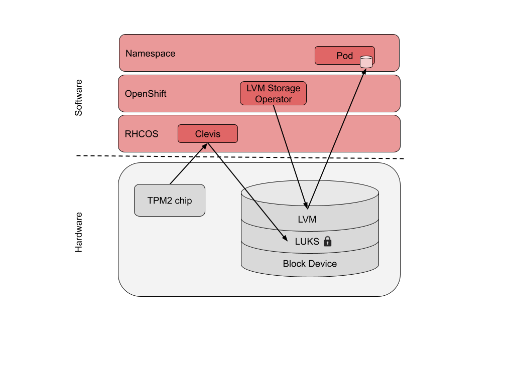

# Encryption at rest for OpenShift application data at the edge
By: dchavero@redhat.com, saledort@redhat.com

Worried about the security of your application data at the edge? Encryption at rest is your solution.

Edge environments are usually located at sites with untrusted networks and lesser physical security than traditional data centers. This puts the security of the application's data running on them at risk. Data destruction, corruption or even the leak of confidential information to malicious actors is possible. To reduce that risk it is recommended to encrypt every disk storing sensitive data, like the one where the application's persistent data is stored.

This article describes how to create an encrypted disk volume during a Single Node OpenShift deployment (a SNO has just one node, where the roles of control plane and worker reside in the same machine) and use LVM (Linux Volume Manager) Storage operator to create a volume group and provision PVCs (Persistent Volume Claims) for your application’s data.


> **Warning**
> 
> Software encrypted drives are not officially supported by Red Hat LVM Storage yet. In this blog we present the current method to use an encrypted device in LVM storage. Future upgrades might introduce new methodology to support this procedure. 

## Concepts and components

The following are important concepts and components involved in block device encryption.

* **Encryption at rest**

When talking about data at rest, we refer to data stored in a hard drive, the data we would like to protect is the data stored in OpenShift Persistent Volumes, which is not transferred over the network or loaded in memory. Having this data encrypted provides protection, if an attacker removes the hard drive from the server and tries to access the data, it won’t be possible without the encryption key. Another advantage of encryption at rest is the fact that a user doesn’t have to do anything to ensure that the data is encrypted, the platform provides an encryption layer that is transparent to the application.

* **TPM**

Trusted Platform Module (TPM) is a standard for a secure cryptoprocessor designed to secure hardware using cryptographic keys. In our case TPM is the chip integrated in the machine where we store the public and private keys used to encrypt a JWE file where the disk encryption key is stored. The key pair stored in the TPM chip is called PIN.

This chip can also store Platform Configuration Registers (PCRs), which are hashes of the platform configuration, for instance the UEFI configuration or hardware inventory. Setting the PCRs values allows a third party software to create trustworthy computing environments by providing attestation of system state.

In this article we are not going to cover anything related to PCRs, we will only use the TPM chip to store the encryption key.

The example in this article is using a TPM2 chip on a physical server. It is also possible to use a virtual TPM (vTPM) to emulate the chip features when working with Virtual Machines. One of the available packages for that is swtpm.

* **LUKS**

Linux Unified Key Setup (LUKS), is a disk encryption specification that implements a standard on-disk format to store encryption keys. It was originally intended for Linux, but is also used by different operating systems. LUKS allows performing block device encryption. LUKS2 is currently the default format in RHEL and RHCOS.. 

Mounting an encrypted volume requires decrypting it first using a passphrase. An automated process to decrypt a LUKS volume, using a PIN stored in a TPM2 chip, is described in the Policy Based Decryption section.

There are different ways to use LUKS  in conjunction with Linux Volume Manager (LVM). In this article we will focus on the use of LVM on LUKS, by creating Logical Volumes on top of an unlocked LUKS container. A kernel subsystem called dm-crypt is used in LUKS to expose encrypted devices as virtual blocks that can be used by LVM.

More information about block device encryption using LUKS in RHEL can be found in the
[official RHEL documentation](https://access.redhat.com/documentation/en-us/red_hat_enterprise_linux/9/html/security_hardening/encrypting-block-devices-using-luks_security-hardening#luks-disk-encryption_encrypting-block-devices-using-luks).

* **Policy Based Decryption (PBD)**

Policy-Based Decryption is a collection of technologies to unlock hard drives on physical and virtual machines. Mounting volumes on an encrypted device requires decrypting it first. This process is done automatically in RHCOS at boot time. As mentioned before TPM2 is used to store the encryption keys of the JWE file containing the disk encryption key. 

For decryption a pluggable framework called Clevis is used. Clevis handles decryption of LUKS volumes by using the key stored in the JWE file. Clevis also supports the use of other technologies for unlocking volumes, such as tang or sss. More information about policy-based decryption can be found in the [official RHEL documentation](https://access.redhat.com/documentation/en-us/red_hat_enterprise_linux/9/html/security_hardening/configuring-automated-unlocking-of-encrypted-volumes-using-policy-based-decryption_security-hardening).
 
* **LVM Storage**

The main OpenShift storage operator offered by Red Hat is OpenShift Data Foundation (ODF), a meta operator that supports other operators such as OpenShift Container Storage (OCS) to deploy Ceph. Ceph is only supported in a cluster with at least 3 nodes. 

Another available storage solution from Red Hat that can be used in a SNO is the Local Storage Operator (LSO). This operator offers local devices on the node as volumes to the pods, without the implementation of some of the advantages of Container Storage Interface (CSI) such as snapshots, volumes resizing, etc. 

To fill those gaps and be able to use a powerful storage solution on SNO the LVM Storage operator was developed. Saying that, it is possible to use LVM Storage on a Multi Node OpenShift (MNO) deployment, but it is only useful in some specific use cases, which are not covered in this article. 

LVM Storage Operator uses Linux Volume Manager (LVM) to create Volume Groups and Logical Volumes, which are exposed as Persistent Volumes on the pods. LVM Storage Operator eases the management of persistent volumes by leveraging CSI features.



## Encryption at the edge

In this article we focus on SNO at the edge but this particular configuration can also be applied in various other Openshift setups. Our demo SNO is running vDU workloads of a 5G RAN infrastructure on top of an HPC ProLiant DL110 server, with TPM2 chip, OpenShift version 4.13.0 and LVM Storage Operator 4.13.0.

Storing data in an encrypted device is a common regulation for Telco infrastructures. There are multiple techniques and solutions to encrypt data in a disk, the technique described in this article is not the silver bullet to mitigate all the threats on our data, but adds protection against some specific threats. For instance, if a disk is replaced by a spare, the regulation may require the supplier to destroy that device to avoid data leaks. In this case the fact that the disk is encrypted helps, once the disk is separated from the server, there is no access to the data as the disk encryption key is still in a JWE file encrypted by keys stored in the TPM chip. Having an encrypted disk can also be effective in other physical attacks such as disk theft, as it is easier to steal a single disk than the whole server with TPM. While in this article we are using TPM, there are other mechanisms to store the PIN outside the server like tang or sss that are mentioned earlier. Another possibility for enhancing the security of the keys is the use of PCRs with TPM.

If a whole server is stolen an attacker can decrypt the disk using TPM. For that case the described solution alone is not enough, but can be used in conjunction with other techniques such as PCR, which is out of scope for this article.

## Cluster configuration

1. **Encrypted partition configuration**

An encrypted partition can be configured at install time by adding the following MachineConfig to the manifest files that create additional configurations. These manifest files are part of the iso image that will be used to install the SNO. More information about manifest configuration files can be found in the [official OpenShift documentation](https://docs.openshift.com/container-platform/4.13/installing/installing_bare_metal_ipi/ipi-install-installation-workflow.html#ipi-install-manifest-configuration-files).

```yaml
apiVersion: machineconfiguration.openshift.io/v1
kind: MachineConfig
metadata:
  name: 98-encrypted-disk-partition-master
  labels:
    machineconfiguration.openshift.io/role: master
spec:
  config:
    ignition:
      version: 3.2.0
    storage:
      disks:
        - device: /dev/nvme0n1
          wipeTable: false
          partitions:
            - sizeMiB: 204800
              startMiB: 600000
              label: application
              number: 5
      luks:
        - clevis:
            tpm2: true
          device: /dev/disk/by-partlabel/application
          name: application
          options:
          - --cipher
          - aes-cbc-essiv:sha256
          wipeVolume: true
```

2. **LVM Storage installation**

You can install LVM Storage Operator on a 4.13 SNO by applying the following resources using the Operator Lifecycle Manager (OLM) in the OpenShift Container Platform web console or the OpenShift command-line interface (CLI):

```yaml
$ cat << EOF | oc apply -f -
apiVersion: v1
kind: Namespace
metadata:
  labels:
    openshift.io/cluster-monitoring: "true"
    pod-security.kubernetes.io/enforce: privileged
    pod-security.kubernetes.io/audit: privileged
    pod-security.kubernetes.io/warn: privileged
  name: openshift-storage
---
apiVersion: operators.coreos.com/v1
kind: OperatorGroup
metadata:
  name: openshift-storage-operatorgroup
  namespace: openshift-storage
spec:
  targetNamespaces:
  - openshift-storage
---
apiVersion: operators.coreos.com/v1alpha1
kind: Subscription
metadata:
  name: lvms-operator
  namespace: openshift-storage
spec:
  installPlanApproval: Automatic
  name: lvms-operator
  source: redhat-operators
  sourceNamespace: openshift-marketplace
EOF
```

Verify the Cluster Service Version (CSV) is ready:

```bash
$ oc get csv -n openshift-storage
NAME                   DISPLAY      VERSION  REPLACES  PHASE
lvms-operator.v4.13.0  LVM Storage  4.13.0             Succeeded
```

More info about LVM Storage on single-node OpenShift clusters can be found in the [official OpenShift documentation](https://docs.openshift.com/container-platform/4.13/storage/persistent_storage/persistent_storage_local/persistent-storage-using-lvms.html).

3. **LVM Storage custom resources**

The LVMCluster CR represents the volume groups that should be created and managed on selected devices (if no paths are specified, all available disks will be used). Through LVMCluster CR the LVM Operator can ensure the required volume groups are available for use by the applications running on OpenShift.

In this article, we will use the previously created encrypted LUKS partition, available in /dev/mapper/application.

Before applying the LVMCluster object check the status of the block devices by logging on to the node and using the lsblk command:

```bash
sh-4.4# lsblk --fs
NAME        	FSTYPE  	LABEL  	UUID                             	MOUNTPOINT
nvme0n1                                                                	 
|-nvme0n1p1                                                            	 
|-nvme0n1p2 	vfat    	EFI-SYSTEM 4C0F-3022                       	 
|-nvme0n1p3 	ext4    	boot   	16ebb796-07e4-424f-9a6d-31ea9daec5ec /boot
|-nvme0n1p4 	crypto_LUKS        	6bd0d5b7-67a4-44b4-87a4-e25b2a01c7c0
| `-root    	xfs     	root   	848adc26-5520-4387-8f27-272ad133f654 /sysroot
`-nvme0n1p5 	crypto_LUKS        	05bd09eb-4dac-47af-88d8-bf8cdbb6b13c
  `-application
```

The *nvme0n1p5* device is the previously configured LUKS encrypted partition and has an empty virtual block device called application handled by *dm-crypt*.

> **Note**
> 
> The root partition encryption was done during OpenShift installation. More info about boot disk encryption at install time can be found in the [official OpenShift documentation](https://docs.openshift.com/container-platform/4.13/installing/install_config/installing-customizing.html#installation-special-config-encrypt-disk_installing-customizing).


If the disk was in use before, it might contain the metadata of a previous filesystem, which will make the next step fail. In this case wipe the content of the disk using the following command:

```bash
sgdisk --zap-all /dev/mapper/application
```

Apply the following to configure the LVMCluster object:

```yaml
$ cat << EOF | oc apply -f -
apiVersion: lvm.topolvm.io/v1alpha1
kind: LVMCluster
metadata:
  name: my-lvmcluster
  namespace: openshift-storage
spec:
  storage:
    deviceClasses:
    - name: vg1
      deviceSelector:
        paths:
        - /dev/mapper/application
      thinPoolConfig:
        name: thin-pool-1
        sizePercent: 90
        overprovisionRatio: 10
EOF
```

Check the LVMCluster CR is in a ready state:

```yaml
$ oc -n openshift-storage get lvmclusters.lvm.topolvm.io -o jsonpath='{.items[*].status.deviceClassStatuses[*]}' | jq
{
  "name": "vg1",
  "nodeStatus": [
    {
      "devices": [
        "/dev/mapper/application",
        "/dev/nvme1n1"
      ],
      "node": "super1",
      "status": "Ready"
    }
  ]
}
```

Check the pods running on the *openshift-storage* namespace:

```bash
$ oc -n openshift-storage get pods
NAME                              	READY   STATUS	RESTARTS   AGE
lvms-operator-665f584c68-jx8p9    	3/3 	Running   0      	43m
topolvm-controller-5496f5d4f4-pskzp   5/5 	Running   0      	84s
topolvm-node-vq4c2                	4/4 	Running   0      	84s
vg-manager-kwfzz                  	1/1 	Running   0      	84s
```
Check that the storage class is created:

```bash
$ oc get storageclass
NAME               PROVISIONER RECLAIMPOLICY VOLUMEBINDINGMODE ALLOWVOLUMEEXPANSION AGE 
lvms-vg1 (default) topolvm.io  Delete        WaitForFirstConsumer
true                 5m
```

Next check again the block devices to review the changes done by the operator (by logging on to the node):

```bash
sh-4.4# lsblk --fs
NAME                      	FSTYPE  	LABEL  	UUID                               	MOUNTPOINT
nvme0n1                                                                                	 
|-nvme0n1p1                                                                            	 
|-nvme0n1p2               	vfat    	EFI-SYSTEM 4C0F-3022                         	 
|-nvme0n1p3               	ext4    	boot   	16ebb796-07e4-424f-9a6d-31ea9daec5ec   /boot
|-nvme0n1p4               	crypto_LUKS        	6bd0d5b7-67a4-44b4-87a4-e25b2a01c7c0   
| `-root                  	xfs     	root   	848adc26-5520-4387-8f27-272ad133f654   /sysroot
`-nvme0n1p5               	crypto_LUKS        	05bd09eb-4dac-47af-88d8-bf8cdbb6b13c   
  `-application           	LVM2_member        	W8RFWF-ofT9-8oUF-ylR1-18Cc-j0GD-rschAQ
	|-vg1-thin--pool--1_tmeta                                                          	 
	| `-vg1-thin--pool--1                                                              	 
	`-vg1-thin--pool--1_tdata                                                          	 
  	`-vg1-thin--pool--1
```

The LUKS container now has a new entry of type LVM2_member, this is the Volume Group created by the operator. 

Let’s view the created Volume Groups and Logical Volumes:

```
sh-4.4# vgs
  VG  #PV #LV #SN Attr   VSize   VFree
  vg1   1   1   0 wz--n- 199.98g 20.00g
sh-4.4# lvs
  LV      	VG  Attr   	LSize   Pool Origin Data%  Meta%  Move Log Cpy%Sync Convert
  thin-pool-1 vg1 twi-a-tz-- 179.80g         	0.00   10.42
```

4. **Application deployment**

Now we can create an application and consume storage from LVM logical volumes. We will use a simple hello-sno application under a testing namespace.

First, create the test namespace:

```bash
$ oc create namespace test-lvms
```

Apply the following configuration to create the PersistentVolumeClaim (a storage request) and a Deployment to bring up one hello-sno pod in the testing namespace and use the claim as a volume:

```yaml
$ cat << EOF | oc apply -f -
apiVersion: v1
kind: PersistentVolumeClaim
metadata:
  name: test-pvc
  namespace: test-lvms
spec:
  accessModes:
  - ReadWriteOnce
  volumeMode: Filesystem 
  resources:
    requests:
      storage: 100Gi 
  storageClassName: lvms-vg1
---
apiVersion: apps/v1
kind: Deployment
metadata:
  name: hello-sno
  namespace: test-lvms
spec:
  replicas: 1
  selector:
    matchLabels:
      app: test
  strategy:
    type: Recreate
  template:
    metadata:
      labels:
        app: test
    spec:
      containers:
      - name: hello-sno
        image: registry.access.redhat.com/ubi8/ubi
        command: ["sh", "-c"]
        args: ["echo Hello SNO! >> /data/hello-sno.txt && sleep 99999999"]
        volumeMounts:  
          - name: data
            mountPath: /data
      volumes:
        - name: data
          persistentVolumeClaim:
            claimName: test-pvc
EOF
```

Next verify the Persistent Volume Claim has been bound correctly:

```bash
$ oc -n test-lvms get pvc
NAME   	STATUS   VOLUME                                 	CAPACITY   ACCESS MODES   STORAGECLASS   AGE
test-pvc   Bound	pvc-bd1ca6d3-c5b5-4559-af99-0ed7e869901b   100Gi  	RWO        	lvms-vg1   	5m35s
```

And review the block devices to see the Logical Volume has been created correctly within the LUKS container:

```
sh-4.4# lsblk --fs
NAME                                               	FSTYPE  	LABEL  	UUID                               	MOUNTPOINT
nvme0n1                                                                                                         	 
|-nvme0n1p1                                                                                                     	 
|-nvme0n1p2                                        	vfat    	EFI-SYSTEM 4C0F-3022                         	 
|-nvme0n1p3                                        	ext4    	boot   	16ebb796-07e4-424f-9a6d-31ea9daec5ec   /boot
|-nvme0n1p4                                        	crypto_LUKS        	6bd0d5b7-67a4-44b4-87a4-e25b2a01c7c0   
| `-root                                           	xfs     	root   	848adc26-5520-4387-8f27-272ad133f654   /sysroot
`-nvme0n1p5                                        	crypto_LUKS        	05bd09eb-4dac-47af-88d8-bf8cdbb6b13c   
  `-application                                    	LVM2_member        	W8RFWF-ofT9-8oUF-ylR1-18Cc-j0GD-rschAQ
	|-vg1-thin--pool--1_tmeta                                                                                   	 
	| `-vg1-thin--pool--1-tpool                                                                                 	 
	|   |-vg1-thin--pool--1                                                                                     	 
	|   `-vg1-7c7b8882--13d8--4439--86f2--7bc71a51715f                                                          	 
	`-vg1-thin--pool--1_tdata                                                                                   	 
  	`-vg1-thin--pool--1-tpool                                                                                 	 
    	|-vg1-thin--pool--1                                                                                     	 
    	`-vg1-7c7b8882--13d8--4439--86f2--7bc71a51715f
```

## Conclusion

Encryption is one of the most used techniques to protect application data against unwanted access. Even though the technique used to encrypt the data is not 100% secure to mitigate all the possible attacks, it is important to take care of our data and try to mitigate the possible threats as much as possible. 

As described in this article, using the LVM  Storage operator with an encrypted device offers  a solid solution to mitigate some of the threats on Telco workloads running at the edge and comply with the regulations of our business.
